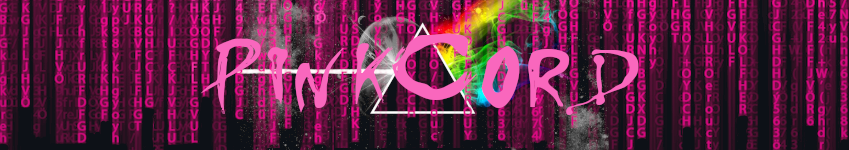

<div id="top"></div>

<h1 align="center" >
    
</h1>
<h2 align='center' >SUBTITLE</h2>
<p align="center"><i>“And when at last the work is done, don't sit down it's time to dig another one" ~Pink Floyd, 'Breathe' (1973)</i> </p>

<table align="right">
 <tr><td><a href="https://github.com/Carol42/PinkCord/blob/main/README-en.md">:us: English</a></td></tr>
 <tr><td><a href="https://github.com/Carol42/PinkCord/blob/main/README.md">:brazil: Português</a></td></tr>
</table>
<span>&nbsp;</span>

<div>
    
    
    
    
    
    
    
    
    
    
</div>

<h3 align='center'>:link:<a href='https://pink-cord.vercel.app/'> Acessar a demonstração (Vercel)</a></h3>

<details>
    <summary>Sumário</summary>
    <ol>
        <li><a href="#pushpin-sobre">Sobre</a></li>
        <li><a href="#diving_mask-a-imersão">A Imersão</a></li>
        <li><a href="#hammer_and_wrench-funcionalidades">Funcionalidades</a></li>
        <li><a href="#wrench-tecnologias-e-recursos-utilizados">Tecnologias e recursos utilizados</a></li>
        <li><a href="#computer-como-baixar-e-rodar-o-projeto">Como baixar e rodar o projeto</a>
            <ul>
                <li><a href="#bulb-pré-requisitos">Pré requisitos</a></li>
            </ul>
        </li>
        <li><a href="#woman_technologist-a-desenvolvedora">A desenvolvedora</a></li>
    </ol>
</details>

## :pushpin: Sobre
DESCRIÇÃO DO PROJETO

<p align="right"><a href="#top"></a></p>

## :diving_mask: A Imersão
Esse projeto foi desenvolvido durante a <a href="https://www.alura.com.br/imersao-react">Imersão React</a> proposta pela <a href="https://www.alura.com.br/">Alura</a> e ministrada pelos instrutores <a href="https://twitter.com/omariosouto">Mario Souto</a> e <a href="https://twitter.com/paulo_caelum">Paulo Silveira</a>, com o apoio de <a href="">Marco Bruno</a> pela <a href="https://www.twitch.tv/marcobrunodev">Twitch</a> e pelo <a href="https://discord.com/">Discord</a> oficial da Imersão.

<p align="right"><a href="#top"></a></p>

## :hammer_and_wrench: Funcionalidades
- [x] .

<p align="right"><a href="#top"></a></p>

## :wrench: Tecnologias e recursos utilizados
- [React](https://pt-br.reactjs.org/)
- [Next.js](https://nextjs.org/)
- [Styled-jsx](https://github.com/vercel/styled-jsx)
- [SkynexUI](https://skynexui.dev/)

<p align="right"><a href="#top"></a></p>

## :computer: Como baixar e rodar o projeto

### :bulb: Pré requisitos

Antes de começar, você vai precisar ter instalado em sua máquina as seguintes ferramentas:
[Git](https://git-scm.com) e [Node.js](https://nodejs.org). 

O gerenciador de pacotes [Yarn](https://yarnpkg.com/) é recomendado, mas você também pode utilizar o [npm](https://www.npmjs.com/), que já vem instalado com o [Node.js](https://nodejs.org). 

Além disso, é bom ter um editor para trabalhar com o código como o [VSCode](https://code.visualstudio.com/).

```bash
# Clonar o repositório
$ git clone https://github.com/Carol42/PinkCord

# Entrar no diretório
$ cd PinkCord

# Instalar as dependências
$ 

# Iniciar o projeto
$ 
```

<p align="right"><a href="#top"></a></p>

## :woman_technologist: A desenvolvedora


</br>
<strong>Caroline Heloíse de Oliveira</strong>
</br>
<sup>Estudante de Engenharia de Computação (UEPG)</sup>
</br>
<a href="https://github.com/Carol42"></a>
<a href="https://linkedin.com/in/carol42"></a>
<a href="mailto:carol42.helo@gmail.com"></a>

<p align="right"><a href="#top"></a></p>