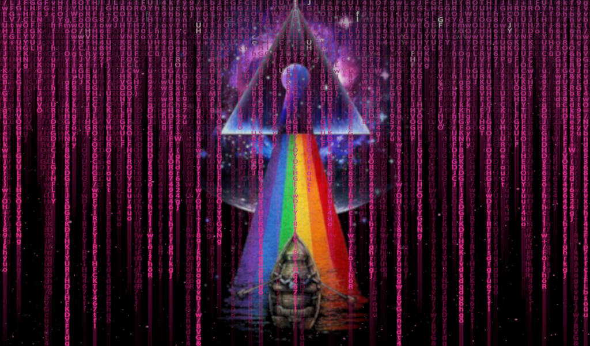

<div id="top"></div>

<h1 align="center" >
    
</h1>
<h2 align='center' >Uma plataforma inspirada no Discord</h2>
<p align="center"><i>“And when at last the work is done, don't sit down it's time to dig another one" ~Pink Floyd, 'Breathe' (1973)</i> </p>

<table align="right">
 <tr><td><a href="https://github.com/Carol42/PinkCord/blob/main/README-en.md">:us: English</a></td></tr>
 <tr><td><a href="https://github.com/Carol42/PinkCord/blob/main/README.md">:brazil: Português</a></td></tr>
</table>
<span>&nbsp;</span>

<div>
    
    
    
    
    
    
    
    
    
    
</div>

<h3 align='center'>:link:<a href='https://pink-cord-carol42.vercel.app/'> Acessar a demonstração (Vercel)</a></h3>

<details>
    <summary>Sumário</summary>
    <ol>
        <li><a href="#pushpin-sobre">Sobre</a></li>
        <li><a href="#diving_mask-a-imersão">A Imersão</a></li>
        <li><a href="#hammer_and_wrench-funcionalidades">Funcionalidades</a></li>
        <li><a href="#wrench-tecnologias-e-recursos-utilizados">Tecnologias e recursos utilizados</a></li>
        <li><a href="#computer-como-baixar-e-rodar-o-projeto">Como baixar e rodar o projeto</a>
            <ul>
                <li><a href="#bulb-pré-requisitos">Pré requisitos</a></li>
            </ul>
        </li>
        <li><a href="#woman_technologist-a-desenvolvedora">A desenvolvedora</a></li>
    </ol>
</details>

## :pushpin: Sobre
O projeto trata-se de uma aplicação de chat inspirada no Discord. Desenvolvido com React.js e Next.js.

<div align="center">
    
</div>

<p align="right"><a href="#top"></a></p>

## :diving_mask: A Imersão
Esse projeto foi desenvolvido durante a <a href="https://www.alura.com.br/imersao-react">Imersão React</a> proposta pela <a href="https://www.alura.com.br/">Alura</a> e ministrada pelos instrutores <a href="https://twitter.com/omariosouto">Mario Souto</a> e <a href="https://twitter.com/paulo_caelum">Paulo Silveira</a>, com o apoio de <a href="">Marco Bruno</a> pela <a href="https://www.twitch.tv/marcobrunodev">Twitch</a> e pelo <a href="https://discord.com/">Discord</a> oficial da Imersão.

Layout original da aplicação, desenvolvido durante as aulas:

<div align="center">
     
</div>

O <a href="https://github.com/alura-challenges/aluracord-matrix">repositório do projeto base</a> conta com uma <a href="https://github.com/alura-challenges/aluracord-matrix#contribuidores">vitrine</a> onde podem ser vistos todos projetos das pessoas que estão participando dessa Imersão!

<details>
    <summary>Conteúdo abordado nas aulas</summary>
    <ol>
        <li>
            <p>Aula 01</p>
            <ul>
                <li>Iniciando um projeto em Next.js;</li>
                <li>Criando components com React usando CSS in JS;</li>
                <li>A estrutura inicial de um projeto Next.js;</li>
                <li>Passando propriedades para components;</li>
                <li>Fazendo deploy na Vercel.</li>
            </ul>
        </li>
        <li>
            <p>Aula 02</p>
            <ul>
                <li>Entendendo melhor o que é uma SPA;</li>
                <li>Conhecendo o useState do React;</li>
                <li>Como trabalhar com eventos no React onSubmit, onClick;</li>
                <li>E sempre após cada push na sua branch principal do GitHub faremos deploy do seu Aluracord na Vercel.</li>
            </ul>
        </li>
        <li>
            <p>Aula 03</p>
            <ul>
                <li></li>
                <li></li>
                <li></li>
            </ul>
        </li>
        <li>
            <p>Aula 04</p>
            <ul>
                <li></li>
                <li></li>
                <li></li>
            </ul>
        </li>
        <li>
            <p>Aula 05</p>
            <ul>
                <li></li>
                <li></li>
                <li></li>
            </ul>
        </li>
    </ol>
</details>

<details>
    <summary>Desafios propostos (das aulas e os meus próprios haha)</summary>
    <ol>
        <li>
            <p>Aula 01</p>
            <ul>
                <li>
                    <p><b>Customizar o Aluracord com o SEU tema, seu background do assunto favorito e utilizar o <a href="https://coolors.co/1be7ff-6eeb83-e4ff1a-ffb800-ff5714">Coolors</a> para gerar uma nova paleta de cores.</b></p>
                    <details>
                    <summary>Ver minha solução</summary>
                    <p>Um dos temas que eu mais gosto de usar em meus projetos de estudos é Matrix, sem sombra de dúvidas. Como exemplo posso mencionar <a href="https://github.com/Carol42/Morpheus-Landing-Page">Morpheus Maketing</a>, <a href="https://github.com/Carol42/A-Saga-do-Robo">A Saga do Robô</a>, <a href="https://github.com/Carol42/Meu-site-pessoal">meu primeiro Site Pessoal</a> e até mesmo meu próprio <a href="https://github.com/Carol42/Carol42">README do perfil no GitHub</a>.</p>
                    <p>Porém como esse já era o tema do projeto original da Imersão, então eu tive que pensar em algo diferente. Uma das minhas bandas favoritas é Pink Floyd, então por que não um Pink Matrix?</p>
                    <p>Foi unindo essas minhas duas paixões que eu criei o tema da aplicação: misturei a arte do álbum 'Dark Side of the Moon', do Pink Floyd, com uma chuva de cógigo rosa! Também apliquei uma transparência no card para que o fundo não ficasse escondido completamente.</p>
                    <p>A paleta de cores que eu criei para o projeto foi:</p>
                    <div align="center">
                        
                    </div>
                    <p>O fundo que eu criei para o projeto:</p>
                    <div align="center">
                        
                    </div>
                    <p>Já que o tema era relacionado a música, achei válido também colocar um player do Spotify com uma preview de uma das músicas do Pink Floyd :heart:</p>
                    <div align="center">
                        
                    </div>
                    <p>A frase inicial também é uma referência a uma das músicas da banda.</p>
                    </details>
                </li>    
            </ul>
        </li>
        <li>
            <p>Aula 02</p>
            <ul>
                <li></li>
                <li></li>
                <li></li>
            </ul>
        </li>
        <li>
            <p>Aula 03</p>
            <ul>
                <li></li>
                <li></li>
                <li></li>
            </ul>
        </li>
        <li>
            <p>Aula 04</p>
            <ul>
                <li></li>
                <li></li>
                <li></li>
            </ul>
        </li>
        <li>
            <p>Aula 05</p>
            <ul>
                <li></li>
                <li></li>
                <li></li>
            </ul>
        </li>
    </ol>
</details>

<details>
    <summary>Conteúdos extras</summary>

- [Formulários em React com Engenharia Reversa no Formik | DevSoutinho](https://www.youtube.com/watch?v=cMq6k7ymv2s)
- [Como pegar dados de uma API? Como fazer AJAX ou "AJAJ"! | Pegando dados de serviços via JavaScript](https://www.youtube.com/watch?v=85vJXFpXLQw)
- [O que todo projeto deveria ter? #01 | GitHub PRO + Projetos Organizados + Linter + EditorConfig](https://www.youtube.com/watch?v=yMRSDdifGW8&t=2s)
- [Jogo com JavaScript #01: Criando um Flappy Bird do ZERO!!!](https://www.youtube.com/watch?v=jOAU81jdi-c&list=PLTcmLKdIkOWmeNferJ292VYKBXydGeDej)
- [Como reduzir a quantidade de ifs do seu código com Strategy | #DevSoutinho](https://www.youtube.com/watch?v=S-jqd6WZ7M0)
- [Como pegar dados de uma API? Como fazer AJAX ou "AJAJ"! | Pegando dados de serviços via JavaScript](https://www.youtube.com/watch?v=85vJXFpXLQw)
- [Como funciona a navegação SPA no NextJS? O componente Link | Pokédex #MergulhoNextJS](https://www.youtube.com/watch?v=-kVnp3fg-v4)
- [Como centralizar no CSS? 3 formas, Vertical/Horizontal + Bônus #DicasDeCSS](https://www.youtube.com/watch?v=Cu-HP-gvggg)
- [Como documentar códigos? Documentando Front End com Storybook!](https://www.youtube.com/watch?v=R41_Qedrzik&t=7s)
- [Tour pelo meu setup: Como configurar ambiente JavaScript/NodeJS para trabalhar? DO JEITO CERTO](https://www.youtube.com/watch?v=GIz71YGzwP4)
- [Documentação interativa com Storybook do SkynexUI](https://storybook.skynexui.dev/?path=/story/components-box--box-component)
- [Flexbox Froggy](https://flexboxfroggy.com/)
- [CSS Grid Garden](https://cssgridgarden.com/)
- []()
- []()

</details>
<details>
    <summary>Aprendizados que considero mais importantes</summary>
    <ul>
        <li>Gastar muito tempo lendo documentação não vai adiantar quase nada se não tentar colocar em prática, porém, dar uma olhada na seção "getting started" antes de começar pode ajudar bastante.</li>
        <li>Mais do que ser um usuário de ferramenta, buscar entender o que está por debaixo dos panos é muito importante. Obviamente, começando aos poucos.</li>
        <li>Devemos ser curiosos, como cientistas, nerds, geeks de verdade!</li>
    </ul>
</details>

<p align="right"><a href="#top"></a></p>


## :hammer_and_wrench: Funcionalidades
- [x] Tela de login (página inicial)

<p align="right"><a href="#top"></a></p>

## :wrench: Tecnologias e recursos utilizados
- [React](https://pt-br.reactjs.org/)
- [Next.js](https://nextjs.org/)
- [Styled-jsx](https://github.com/vercel/styled-jsx)
- [SkynexUI](https://skynexui.dev/)

#### Fontes
- [Roboto Slab](https://fonts.google.com/specimen/Roboto+Slab)
- [Floydian](https://fontmeme.com/fonts/floydian-font/)

<p align="right"><a href="#top"></a></p>

## :computer: Como baixar e rodar o projeto

### :bulb: Pré requisitos

Antes de começar, você vai precisar ter instalado em sua máquina as seguintes ferramentas:
[Git](https://git-scm.com) e [Node.js](https://nodejs.org). 

O gerenciador de pacotes [Yarn](https://yarnpkg.com/) é recomendado, mas você também pode utilizar o [npm](https://www.npmjs.com/), que já vem instalado com o [Node.js](https://nodejs.org). 

Além disso, é bom ter um editor para trabalhar com o código como o [VSCode](https://code.visualstudio.com/).

```bash
# Clonar o repositório
$ git clone https://github.com/Carol42/PinkCord

# Entrar no diretório
$ cd PinkCord

# Instalar as dependências
$ yarn install 

# Iniciar o projeto
$ yarn dev
```

<p align="right"><a href="#top"></a></p>

## :woman_technologist: A desenvolvedora


</br>
<strong>Caroline Heloíse de Oliveira</strong>
</br>
<sup>Estudante de Engenharia de Computação (UEPG)</sup>
</br>
<a href="https://github.com/Carol42"></a>
<a href="https://linkedin.com/in/carol42"></a>
<a href="mailto:carol42.helo@gmail.com"></a>

<p align="right"><a href="#top"></a></p>